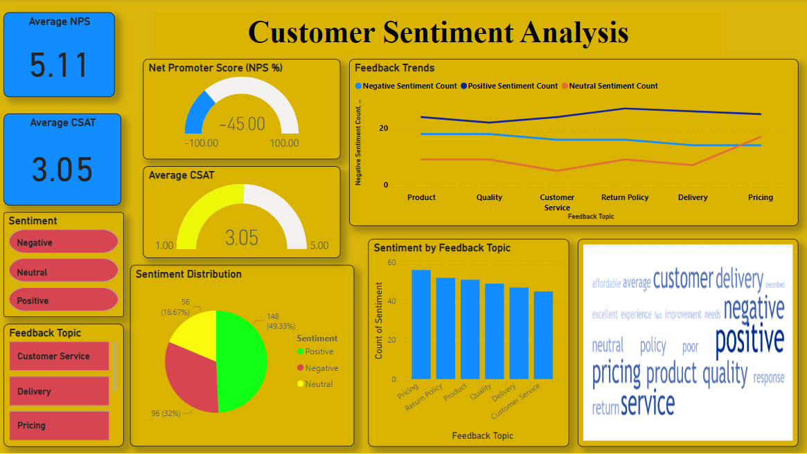
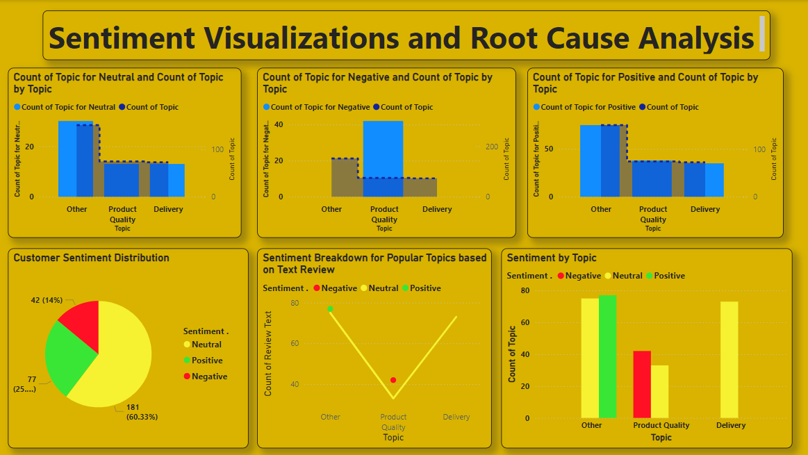

# Customer Sentiment Analysis Dashboard

This repository contains a project focused on analyzing customer sentiment based on feedback data. The analysis was performed using **Power BI**, and the resulting dashboard provides insights into key metrics like Net Promoter Score (NPS), Customer Satisfaction Score (CSAT), sentiment distribution, and root cause analysis.

## Features of the Dashboard

1. **Average NPS and CSAT**:
   - Displays the **average Net Promoter Score (NPS)** and **Customer Satisfaction Score (CSAT)**.
   - Visualized using gauge charts for intuitive understanding.

2. **Sentiment Distribution**:
   - Shows the breakdown of **positive**, **neutral**, and **negative** sentiments.
   - A pie chart visualizes the overall sentiment proportions.

3. **Feedback Topics Analysis**:
   - Highlights key topics of feedback, including **Delivery**, **Pricing**, and **Customer Service**.
   - Sentiments are categorized by topic for detailed analysis.

4. **Feedback Trends**:
   - Displays sentiment trends over time for different topics.
   - A line chart helps track changes and identify focus areas.

5. **Root Cause Analysis**:
   - Breaks down sentiment counts (positive, neutral, negative) for each feedback topic.
   - Includes bar charts for in-depth analysis of problem areas.

6. **Word Cloud**:
   - Provides a visual representation of frequently used words in feedback, offering a quick overview of customer concerns and praise.

## Tools and Techniques

- **Power BI**:
  - Used for creating all visualizations and performing manual data analysis.
- **Excel/CSV**:
  - Data preparation and cleaning were handled before importing into Power BI.

## Screenshots of the Dashboard

### Main Dashboard: Customer Sentiment Analysis


### Root Cause Analysis and Visualizations


## Key Insights

1. **NPS and CSAT**:
   - The average **NPS** is **5.11**, indicating room for improvement in customer loyalty.
   - The average **CSAT** score is **3.05**, reflecting moderate customer satisfaction.

2. **Feedback Topics**:
   - **Negative Sentiment**: Primarily focused on **Product Quality** and **Delivery**.
   - **Positive Sentiment**: Emphasizes strong **Customer Service**.

3. **Word Cloud Insights**:
   - Common terms like **"pricing"**, **"delivery"**, and **"quality"** indicate recurring areas of focus.

## How to Use the Dashboard

1. Open the Power BI `.pbix` file included in this repository:
   - `customer_sentiment_analysis.pbix`

2. Interact with the visualizations to:
   - Filter data by sentiment type.
   - Drill down into specific feedback topics.
   - Analyze trends and distributions for actionable insights.


## Folder Structure

```plaintext
Customer-Sentiment-Analysis/
├── customer sentiment.pbix               # Power BI dashboard file
├── Customer_Sentiment_Analysis_Data/     # Folder for raw or processed data files
├── Dashboard1/                           # Folder containing screenshots of the main dashboard
├── Dashboard2/                           # Folder containing screenshots of the root cause analysis
└── README.md                             # Project documentation file


