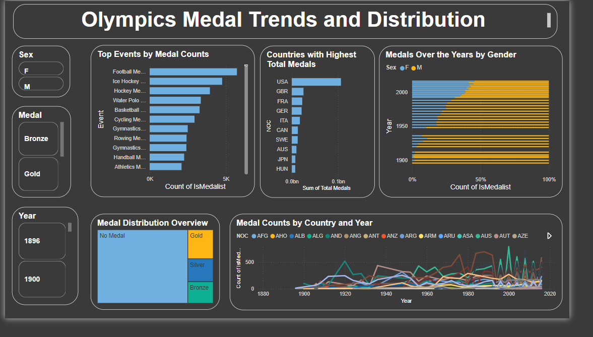
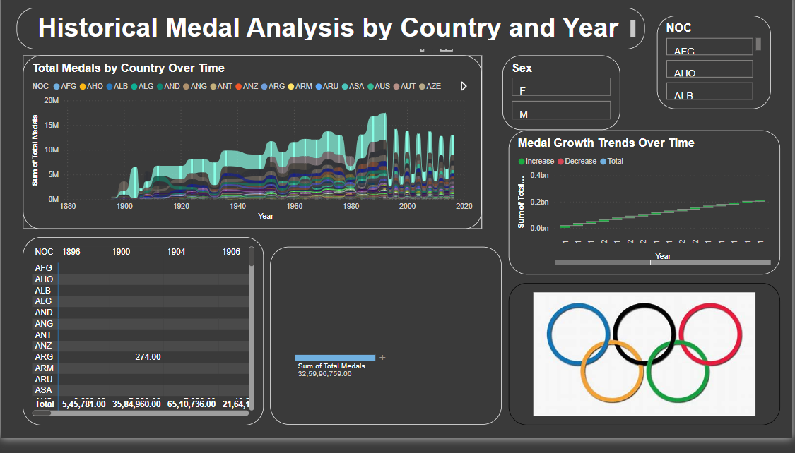

# Olympics Medal Analysis Dashboard

## 📊 Project Overview

This project presents an **Olympics Medal Analysis Dashboard**, built using **Microsoft Power BI**, to visualize and analyze Olympic medal trends and distributions. The dataset, sourced from **Kaggle**, provides detailed insights into the performance of countries, events, and athletes across Olympic history.

---

## 🛠 Features

1. **Olympics Medal Trends and Distribution**  
   - **Top Events by Medal Counts**: Discover which sports have the most medals awarded.  
   - **Countries with Highest Total Medals**: A leaderboard of countries by total medal count.  
   - **Medals Over the Years by Gender**: Gender-based trends in medal distribution.  
   - **Medal Distribution Overview**: A snapshot of Gold, Silver, Bronze, and No Medal counts.  
   - **Medal Trends by Country and Year**: Country-wise performance trends over time.

2. **Historical Medal Analysis by Country and Year**  
   - **Total Medals by Country Over Time**: Long-term performance analysis of nations.  
   - **Medal Growth Trends Over Time**: Visualizing medal trends to identify growth patterns.  
   - **Year-wise Medal Statistics**: Breakdown of medal data by year.

3. **Dynamic Filters**  
   - Filters for refining results by gender, medal type, year, and country.  
   - Intuitive interactions for exploring data on different levels.

---

## 🧰 Technology Stack

- **Power BI**: For designing interactive dashboards.  
- **Kaggle Dataset**: Historical Olympic medal data.  
  - [Dataset Link](https://www.kaggle.com/datasets/heesoo37/120-years-of-olympic-history-athletes-and-results) 
---

## 📸 Dashboard Snapshots

### 1. Olympics Medal Trends and Distribution  

### 2. Historical Medal Analysis by Country and Year  

---

## 🚀 Usage Instructions

1. **Open the Project**  
   - Load the `.pbix` file in Microsoft Power BI.

2. **Explore the Dashboards**  
   - Use filters for customized insights.  
   - Navigate between pages for different analysis aspects.

3. **Dataset Note**  
   - Ensure the Kaggle dataset is loaded correctly if working with raw data.

---

## 📂 Project Files

- **Dashboards**  
  - `Page 1`: Olympics Medal Trends and Distribution  
  - `Page 2`: Historical Medal Analysis by Country and Year  

- **Dataset**: Kaggle's Olympic historical dataset.  

---

## 🌟 Key Insights

- The USA has consistently dominated the Olympics in terms of total medals.  
- Certain events like football and hockey are historically significant in medal counts.  
- The representation of women in the Olympics has steadily increased over time.

---

## ✨ Future Enhancements

- Add drill-through capabilities for athlete-level analysis.  
- Enhance with predictive analytics using Power BI's AI features.  
- Connect live datasets for real-time medal updates.

---

## 📝 Author and License

**Author**: Abinaya Goud  
**Dataset Source**: Kaggle  
**License**: This project is licensed under the MIT License.

